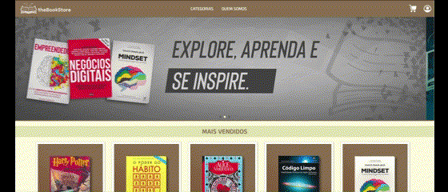
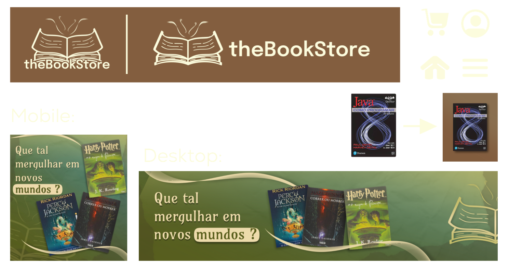

# TheBookStore
Desenvolvimento de uma Loja de Livros, praticando conhecimentos em HTML e CSS e incluindo dinamismo através do JavaScript. 

## Desenvolvimento
Este projeto foi elaborado seguindo o conceito de Mobile-First, visando alcançar uma experiência agradável e dinâmica ao usuário, além de tornar esse site responsivo.

## SwiperJS
Utilização dessa biblioteca para criação de um carrossel com os banners das categorias de livros do site. 

    

## Carrinho de Compras
Implantação de um carrinho de compras praticando a recuperação de elementos do HTML (querySelector, getElementsByTagName/Class), identificação de cliques (addEventListener), tratamento de informações (split), inserção de textos (innerHTML).

    

##  Criações autorais
- Logotipos;
- Ícones (Menu, Carrinho de Compras, Usuário);
- Banners das Categorias (Fantasia, Tecnologia, Negócios);

    

*As imagens utilizadas foram tratadas a fim de reduzir seu tamanho em disco;* 
*As imagens das capas dos livros foram baixadas e adicionadas em mockups autorais alinhados com a identidade da marca.*

## Cores
Na composição do site foi utilizada uma paleta de cores baseada em alguns tons terrosos, que buscam carregar um sentimento de sossego e ao mesmo tempo sofisticação. Além disso o principal tom utilizado é o marrom, uma cor característica muito encontrada em bibliotecas, dando cores a prateleiras, mesas e outros elementos.

    

### Deploy: https://the-book-store-inky.vercel.app/index.html
